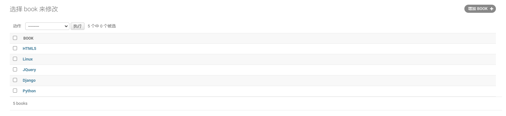
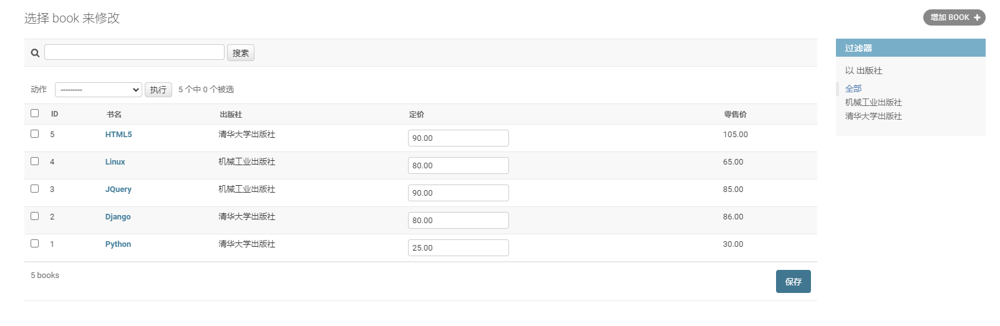

### admin管理后台

+   django提供了比较完善的后台管理数据库的接口,可供开发过程中调用和测试使用

+   django会收集所有已注册的模型类,为这些模型类提供数据管理界面,供开发者使用

+   创建后台管理账号 - 该账号为管理后台最高权限账号

    ```bash
    python manage.py createsuperuser
    ```


### 注册自定义模型类

若要自己定义的模型类也能在/admin后台管理界面中显示和管理.需要将自己的类注册到后台管理界面

注册步骤:

1.   在应用app中的`admin.py`中导入注册要管理的模型models类,如:

     ```python
     from .models import Book
     ```

2.   调用`admin.site.register()`方法进行注册 

     

### 修改自定义模型类的数据样式

+   在admin后台管理数据库中对自定义的数据记录都展示为`XXXX object`类型的记录,不便于阅读和判断

+   在用户自定义的模型类中可以重写`__str__(self)`方法解决显示问题

    ```python
    def __str__(self):
            return self.title
    ```




### 模型管理器类

作用: 为后台管理界面添加便于操作的新功能

说明: 后台管理器类必须继承自`django.contrib.admin`里的`ModelAdmin`类

使用方法

1.   在`<app>/admin.py`里定义模型管理器类

     ```python
     class XXXManager(admin.ModelAdmin):
         ...
     ```

2.   绑定注册模型管理器类和模型类

     ```python
     from django.contrib import admin
     from .models import *
     admin.site.register(模型类,模型管理器类)
     ```

示例:

```python
from django.contrib import admin
from .models import Book

class BookManager(admin.ModelAdmin):
    # 要显示的字段
    list_display = ['id','title','pub','price','market_price']
    # 控制list_play中的字段,哪些可以链接到修改界面
    list_display_links = ['title']
    # 添加过滤器
    list_filter = ['pub']
    # 添加搜索框[模糊查询]
    search_fields = ['title']
    # 添加可在列表页编辑的字段

admin.site.register(Book,BookManager)
```



### 再谈Meta类

通过Meta内嵌类定义模型类属性

```python
class Meta:
    db_table = '数据表名'
    verbose_name = '单数名'	# 给模型对象一个易于理解的名称(单数),用于显示在admin管理界面
    verbose_name_plural = '复数名'	# 给模型对象一个易于理解的名称(复数),用于显示在admin管理界面
```

