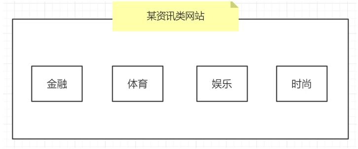
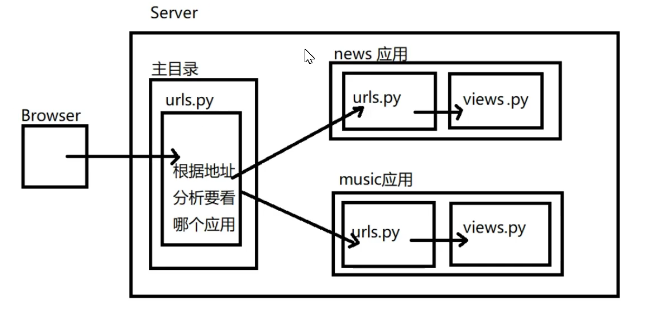

## 应用

### 什么是应用

+   应用在django项目中是一个独立的业务模块,可以包含自己的路由,视图,模板,模型

    	


### 创建应用

#### 步骤一

用`manage.py`中的子命令`startapp`创建应用文件夹

```bash
python3 manage.py startapp music
```

#### 步骤二

在`settings.py`的`INSTALLED_APPS`列表中配置安装此应用

+   `settings.py`配置样例

    ```python
    INSTALLED_APPS = [
        # ...
        'user.apps.UserConfig',		# 用户信息模块
        'music.apps.MusicConfig',	# 音乐模块
    ]
    ```

    

## 分布式路由

django中,主路由配置文件(`urls.py`)可以不处理用户具体路由,主路由配置文件可以做请求的分发(分布式请求处理).具体的请求可以由各自的应用来处理

	


### 配置分布式路由

#### 步骤一 - 主路由中调用include函数

语法: `include('app名字.url模块名')`

作用: 用于将当前路由转到各个应用的路由配置文件的`urlpatterns`进行分布式处理

```python
from django.urls import path,include
from . import views

urlpatterns = [
    path('admin/', admin.site.urls),
    path('music/', include('music.urls'))
]
```

#### 步骤二 - 应用下配置`urls.py`

应用下手动创建`urls.py`文件,内容结构同主路由文件完全一样

```python
from django.urls import path
from . import views

urlpatterns = [
    path('index/',views.index_view)
]
```


## 应用下的模板

应用内部可以配置模板目录

1.   应用下手动创建`templates`文件夹
2.   `settings.py`中开启应用模板功能
     +   `TEMPLATE`配置项中的`'APP_DIRS'`值为`True`即可

应用下`templates`和外层`templates`都存在时,django得查找模板规则

1.   优先查找外层templates目录下的模板
2.   按`INSTALLED_APPS`配置下的应用顺序逐层查找