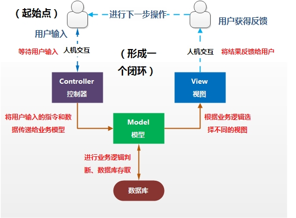
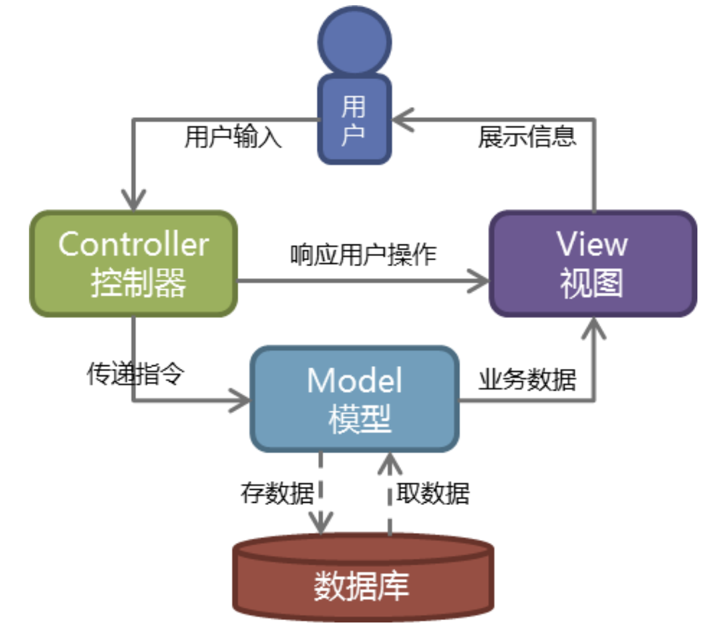

## MVC和MTV

### 传统的MVC

**MVC** 代表 **Model-View-Controller(模型-视图-控制器)** 模式

+   M 模型层,主要用于对数据库层的封装
+   V 视图层,用于向用户展示结果
+   C 控制器层,用于处理请求,获取数据,返回结果

**作用**: 降低模块间的耦合度(解耦)

	


### MTV模式

**MTV** 代表 **Model-Template-View(模型-模板-视图)** 模式

+   M 模型层,负责与数据库交互
+   T 模板层,负责呈现内容到浏览器
+   V 视图层,是核心,负责接收请求,获取数据,返回结果

**作用**: 降低模块间的耦合度(解耦)

	


## 模板

1.   模板是可以根据字典数据动态变化的html网页
2.   模板是可以根据视图中传递的字典数据动态生成相应的html网页


### 模板配置

+   创建模板文件夹 <项目名>/templates

+   在settings.py 中 TEMPLATES 配置项

    1.   BACKEND 指定模板的引擎
    2.   DIRS 模板的搜索目录(可以是一个或多个)
    3.   APP_DIRS:是否要在应用中的templates中搜索模板文件
    4.   OPTIONS 有关模板的选项

+   配置项需要修改部分

    设置DIRS - `'DIRS':[os.path.join(BASE_DIR,'templates')]`


### 模板的加载方式

#### 方案一 - 通过loader获取模板,通过HttpResponse进行响应

在视图函数中

```python
from django.template import loader
# 1.通过loader加载模板
t = loader.get_template("模板文件名")
# 2.将t转换成html字符串
html = t.render(字典数据) # 字典数据用于将变量传递给模板层,可不填
# 3.用响应对象将转换成的字符串内容返回给浏览器
return HttpResponse(html)
```


#### 方案二 - 使用render()直接加载并响应模板

在视图函数中

```python
from django.shortcuts import render
return render(request,'模板文件名'[,字典数据]) 
```


### 视图层与模板层之间的交互

1.   视图函数中可以将python变量封装到**字典**中传递到模板

     样例:

     ```python
     def xxx_view(request):
         dic={
             '变量1':'值1',
             '变量2':'值2'
         }
         return render(request,'xxx.html',dic)
     ```

2.   模板中,我们可以用`{{变量名}}`的语法调用视图传进来的变量

