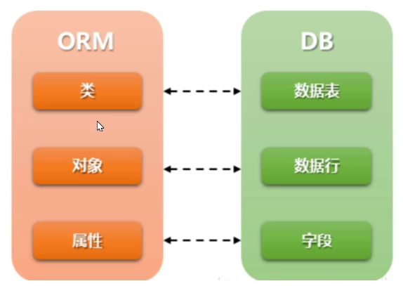

### 模型层

+   模型层 - 负责跟数据库之间进行通信


### Django配置mysql

+   安装`mysqlclient`

+   安装前需确认是否已安装`python3-dev`和 `default-libmysqlclient-dev`

    1.   `sudo apt list --installed|grep -E 'libmysqlclient-dev|python3-dev'`

    2.   若命令无输出则需安装

         `sudo apt-get install python3-dev default-libmysqlclient-dev`

+   `pip installl mysqlclient`

+   创建数据库

    ```sql
    create database mysite default charset utf8;
    ```

+   `settings.py`里进行数据库的配置

    +   修改`DATEBASES`配置项的内容,由`sqllite3`变为`mysql`

        ```python
        DATABASES = {
            'default': {
                'ENGINE': 'django.db.backends.mysql',
                'NAME': 'mysite',
                'USER': 'root',
                'PASSWORD': 'sj18758859793',
                'HOST': '116.63.43.221',
                'PORT': '3306'
            }
        }
        ```

+   `ENGINE` - 指定数据库存储引擎

    ```python
    'ENGINE': 'django.db.backends.mysql'
    'ENGINE': 'django.db.backends.sqlite3'
    'ENGINE': 'django.db.backends.oracle'
    'ENGINE': 'django.db.backends.postgresql'
    ```

+   `NAME` - 指定要连接的数据库的名称

+   `USER` - 指定登录到数据库的用户名

+   `PASSWORD` - 数据库密码

+   `HOST/PORT` - 连接具体数据库的ip和端口


### 什么是模型

+   模型是一个python类,它是由`django.db.models.Model`派生出的子类
+   一个模型代表数据库中的一张数据表
+   模型类中每一个类属性都代表数据库中的一个字段
+   模型是数据交互的接口,是表示和操作数据库的方法和方式


### ORM框架

+   定义: ORM(Object Relational Mapping) 即对象关系映射,它是一种程序技术,它允许你使用类和对象对数据库进行操作,从而避免通过sql语句操作数据库

+   作用: 

    1.   建立模型类和表之间的对应关系,允许我们通过面向对象的方式来操作数据库
    2.   根据设计的模型类生成数据库中的表格
    3.   通过简单的配置就可以进行数据库的切换

+   优点:

    +   只需要面向对象编程,不需要面向数据库编写代码
        +   对数据库的操作都转换成对类属性和方法的操作
        +   不用编写各种数据库的sql语句
    +   实现了数据模型和数据库的解耦,屏蔽了不同数据库操作上的差异
        +   不再关注用的是mysql还是Oracle等数据库的内部细节
        +   通过简单的配置就可以轻松更换数据库,而不需要修改代码

+   缺点:

    +   对于复杂业务,使用成本较高
    +   根据对象的操作转换成sql语句,根据查询的结果转换成对象,在映射的过程中有性能损失

+   映射图

    	


### 模型示例

+   此示例为添加一个bookstore_book 数据表来存放图书馆中书目信息

    1.   添加一个bookstore 的 app

         ```bash
         python manage.py startapp bookstore
         ```

    2.   添加模型类并注册app

+   模型类代码示例

    ```python
    # file: bookstore/models.py
    from django.db import models
    
    class Book(models.Model):
        title = models.CharField('书名',max_length=50,default='')
        price = models.DecimalField('定价',max_digits=7,decimal_places=2,default=0.0)
    ```


### 数据库迁移

+   迁移是django同步您对模型所做更改(添加字段,删除模型等)到您的数据库模式的方式

    +   生成迁移文件 - 执行 `python manage.py makemigrations`

        将应用下的`models.py`文件生成一个中间文件,并保存在`migrations`文件夹中

    +   执行迁移脚本程序 - 执行`python manage.py migrate`

        执行迁移程序实现迁移,将每个应用下的`migrations`目录中的中间文件同步回数据库


### 模型类创建

```python
from django.db import models

class 模型类名(models.Model):
    字段名 = models.字段类型(字段选项)
```


