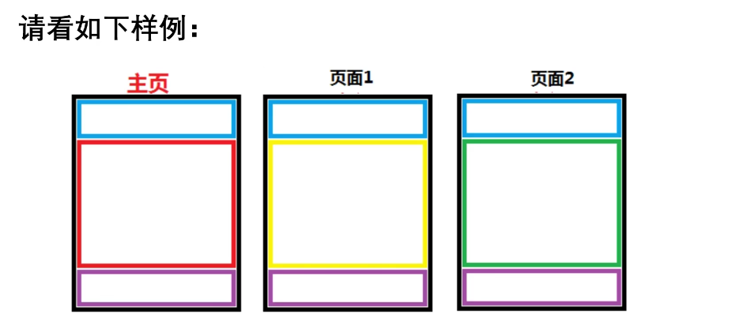

### 模板过滤器

定义: 在变量输出时对变量的值进行处理

作用: 可以通过使用过滤器来改变变量的输出显示

语法:`{{变量|过滤器1:'参数1'|过滤器2:'参数2'...}}`

| 常用过滤器        | 说明                                                         |
| ----------------- | ------------------------------------------------------------ |
| lower             | 将字符串全部转换为小写                                       |
| upper             | 将字符串全部转换为大写                                       |
| safe              | 默认不对变量内的字符串进行html转义                           |
| add:'n'           | 将value的值增加n                                             |
| truncatechars:'n' | 如果字符串多于指定的字符数量,那么会被截断.截断的字符串将以可翻译的省略号序列('...')结尾 |
| ...               | ...                                                          |


### 模板的继承

	

模板的继承可以使父模板的内容重用,子模版直接继承父模板的全部内容并可以覆盖父模板中响应的块

语法 - 父模板中:

+   定义父模板中的块block标签
+   标识哪些在子模块中是允许被修改的
+   block标签: 在父模板中定义,可以在子模板中被覆盖

语法 - 子模板中:

+   继承模板extends标签(写在模板文件的第一行)

    例如``

+   子模板重写父模板中的内容块

    ```html
    
    子模板块用来覆盖父模板中 block_name 块的内容
    
    ```

重写的覆盖规则

+   不重写,将按照父模板的效果显示
+   重写,则按照重写效果显示

注意

+   模板继承时,服务端的动态内容无法继承