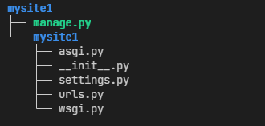

### 创建项目

如果这是你第一次使用 Django 的话，你需要一些初始化设置。也就是说，你需要用一些自动生成的代码配置一个 Django project —— 即一个 Django 项目实例需要的设置项集合，包括数据库配置、Django 配置和应用程序配置。

打开命令行，`cd` 到一个你想放置你代码的目录，然后运行以下命令：

```bash
# django-admin startproject 项目名
django-admin startproject mysite1
```

创建完成后**项目的结构**

	

这些目录和文件的用处是：

+   最外层的 `mysite/` 根目录只是你项目的容器， 根目录名称对 Django 没有影响，你可以将它重命名为任何你喜欢的名称。
+   `manage.py`: 一个让你用各种方式管理 Django 项目的命令行工具。
+   里面一层的 `mysite/` 目录包含你的项目，它是一个纯 Python 包。它的名字就是当你引用它内部任何东西时需要用到的 Python 包名。 (比如 `mysite.urls`).
+   `mysite/__init__.py`：一个空文件，告诉 Python 这个目录应该被认为是一个 Python 包。
+   `mysite/settings.py`：Django 项目的配置文件。
+   `mysite/urls.py`：Django 项目的 URL 声明，就像你网站的“目录”。
+   `mysite/asgi.py`：作为你的项目的运行在 ASGI 兼容的 Web 服务器上的入口。
+   `mysite/wsgi.py`：作为你的项目的运行在 WSGI 兼容的Web服务器上的入口。


### 用于开发的简易服务器

如果你的当前目录不是外层的 `mysite` 目录的话，请切换到此目录，然后运行下面的命令：

```bash
python manage.py runserver
```

你应该会看到类似如下的输出:

```bash
Performing system checks...

System check identified no issues (0 silenced).
December 23, 2021 - 16:42:04
Django version 3.2.10, using settings 'mysite.settings'
Starting development server at http://127.0.0.1:8000/
Quit the server with CONTROL-C.
```

**更换端口**

默认情况下，`runserver`命令会将服务器设置为监听本机内部 IP 的 8000 端口。

如果你想更换服务器的监听端口，请使用命令行参数。举个例子，下面的命令会使服务器监听 8080 端口：

```bash
python manage.py runserver 8080
```

如果你想要修改服务器监听的IP，在端口之前输入新的。比如，为了监听所有服务器的公开IP（这你运行 Vagrant 或想要向网络上的其它电脑展示你的成果时很有用），使用：

```bash
python manage.py runserver 0:8000
```