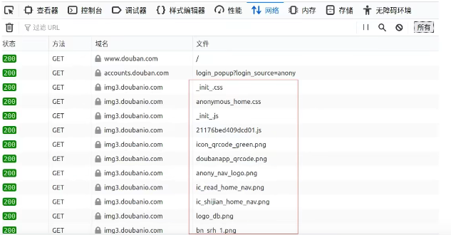

### 什么是静态文件

+   什么是静态文件

    -   如图片,css,js,音频,视频

        	

+   静态文件配置 - settings.py中

    1.   配置静态文件中的访问路径(该配置默认存在)

         +   通过那个url地址找静态文件

         +   `STATIC_URL = '/static/'`

         +   说明:

             指定访问静态文件时是需要通过/static/xxx或http://127.0.0.1:8000/static/xxx (xxx 表示具体的静态资源位置)

    2.   配置静态文件的存储路径`STATICFILES_DIRS`

         `STATICFILES_DIRS`保存的是静态文件在服务器端的存储位置

         ```python
         # file settings.py
         STATICFILES_DIRS = (
             os.path.join(BASE_DIR,'static'),
         )
         ```


### 静态文件访问

模板中访问静态文件 - img标签为例

+   方案一 - 直接拼接访问路径

    ```html
    
    
    ```

+   方案二 - 通过``标签访问静态文件

    1.   加载static - ``

    2.   使用静态资源 - ``

    3.   样例

         ```html
         
         
         ```

         