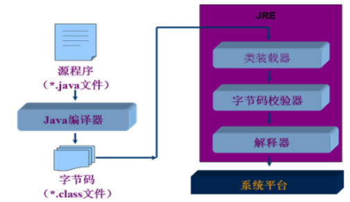

## Java的特性和优势

#### 简单性

就是c++语法的纯净版.没有头文件,指针运算,结构,联合,操作符重载,虚基类等等.由于语法基于c,因此学习起来完全不费力.

#### 可移植性(跨平台性)

这是Java的一个重要的优势.Java代码或者说字节码、二进制码可以跨平台的移植,而不用管具体的操 作系统和硬件环境.

“一次编写,随处运行”:“write once, run anywhere”

Java在设计时就很注重移植和跨平台性.比如:Java的int永远都是32位,不像c++可能是16,32,可能是根据编译器厂商规定的变化,这样的话程序的移植就会非常麻烦.

#### 高性能

 JIT(JUST IN TIME)即时编译.将一些“热点”字节码编译成本地机器码,并将结果缓存起来,在需要的时候重新调用.这样的话,使Java程序的执行效率大大提高,某些代码甚至接近c++的效率.随着这种技 术的一天天完善,也许有一天会超越编译代码的效率.

#### 分布式

Java是为internet的分布式环境设计的,因为他能够处理tcp/ip协议.事实上,通过url访问一个网络资源和访问本地文件是一样简单的.Java还支持远程方法调用(RMI,remote method Invocation),使程序能够通过网络调用方法.

#### 动态性

就是在需要时将某些代码添加到正在运行的程序中(反射机制).当需要把某些代码添加到正在运行的程序中时,动态性是一个非常重要的特性.Java的动态特性是其面向对象设计方法的扩展.它允许程序动态地装入运行过程中所需要的类,这是C++语言进行面向对象程序设计所无法实现的.

#### 多线程

多线程的使用可以带来更好的交互响应和实时行为.多线程的简单性是Java成为主流服务器端开发语言的主要原因之一.

#### 安全性

Java适合于网络/分布式环境,为了达到这个目标,在安全性方面投入了很大的精力,使Java可以构建防病毒,防篡改的系统.

#### 健壮性

Java是一种健壮的语言,吸收了C/C++ 语言的优点,但去掉了其影响程序健壮性的部分(如:指针、内存的申请与释放等).Java程序不可能造成计算机崩溃,Java系统仔细检测对内存的每次访问,确认它是合法的,而且不致引起任何问题.不过,即使Java程序也可能有错误,如果出现某种出乎意料之事,程序也不会崩溃,而是把该例外抛弃,再通过异常处理机制,程序就会发现这类例外,并加以处理.


## Java三大版本

1.   **JavaSE**:它是Java的标准版,是整个Java的基础和核心,这是我们主要学习的一个部分,也是JavaEE和JavaME技术的基础,主要用于开发桌面应用程序.学会后可以做一些简单的桌面应用如:扫雷,连连看等.

2.   **JavaME**:它是Java的微缩版,主要应用于嵌入式开发,比如手机程序的开发.

3.   **JavaEE**:也叫Java的企业版,它提供了企业级应用开发的完整解决方案,比如开发网站,还有企业的一些应用系统,是Java技术应用最广泛的领域.主要还是偏向于WEB的开发,而JavaEE的基础就是JavaSE.


## JDK和JRE

	


#### JDK

Java 2 SDK (Development Kit)包含:JRE的超集,包含编译器和调试器等用于程序开发的文件

#### JRE

Java Runtime Environment (JRE) 包含:Java虚拟机、库函数、运行Java应用程序和Applet所必须文件

Java运行环境的三项主要功能:

+   加载代码:由class loader 完成 
+   校验代码:由bytecode verifier 完成
+   执行代码:由 runtime interpreter完成

#### 区别和联系:

+   sdk(也就是jdk)是jre的超集,是在jre的基础上增加了编译器及其他一些开发工具.

+   jre就是java运行时环境,包括了jvm和其它一些java核心api,任何一台电脑,只有安装了jre才可以运行java程序. 

+   如果只是要运行Java程序,之需要JRE就可以. JRE通常非常小,也包含了JVM. 

+   如果要开发Java程序,就需要安装JDK.


## JVM(Java Virtual Machine)

JVM是一种规范,可以使用软件来实现,也可以使用硬件来实现,就是一个虚拟的用于执行bytecodes 字节码的计算机.他也定义了指令集、寄存器集、结构栈、垃圾收集堆、内存区域.

 JVM负责将java字节码解释运行,边解释边运行,这样,速度就会受到一定的影响.JAVA提供了另一种解释运行的方法JIT(just in time),可以一次解释完,再运行特定平台上的机器码,高级的JIT可以只能分析热点代码,并将这些代码转成本地机器码,并将结果缓存起来,下次直接从内存中调用,这样就大大提高了执行JAVA代码的效率.这样就实现了跨平台、可移植的功能.

1.   JVM是指在一台计算机上由软件或硬件模拟的计算机；它类似一个小巧而高效的CPU.
2.   byte-code代码是与平台无关的是虚拟机的机器指令.
3.   java字节代码运行的两种方式:
     +   方式interpreter(解释)
     +   Just-in-time(即时编译):由代码生成器将字节代码转换成本机的机器代码,然后可以以较高速度执行

JAVA的跨平台实现的核心是不同平台使用不同的虚拟机

不同的操作系统有不同的虚拟机.Java 虚拟机机制屏蔽了底层运行平台的差别,实现了“一次编译,随处运行”.


## Java开发环境搭建

[Java 开发环境配置 | 菜鸟教程 (runoob.com)](https://www.runoob.com/java/java-environment-setup.html)


## 第一个Java程序

1.   随便建立一个文件夹用于存放代码

2.   新建文件Hello.java

3.   编写程序

     ```java
     public class Hello{
     	public static void main(String[] args){
     		System.out.println("Hello,World!");
     	}
     }
     ```

4.   保存文件,打开命令行(cmd),利用javac编译

     ```powershell
     # 通过cd命令跳转到新建的文件目录下
     cd 新建文件夹的路径
     # javac编译
     javac Hello.java
     # 如果没有报错,查看文件夹下是否有一个新的文件(Hello.class)
     # 如果没有出现,恭喜！说明你遇到了你在学Java当中的第一个Bug
     ```

5.   通过java执行

     ```powershell
     # java命令执行
     java Hello
     # 成功输出Hello,world!
     ```

     	


**编写Java程序时应注意**:

+   **大小写敏感**:Java是大小写敏感的,这就意味着标识符Hello与hello是不同的.
+   **类名**:对于所有的类来说,类名的首字母应该大写.如果类名由若干单词组成,那么每个单词的首字母应该大写,例如**MyFirstJavaClass** .
+   **方法名**:所有的方法名都应该以小写字母开头.如果方法名含有若干单词,则后面的每个单词首字母大写.
+   **源文件名**:源文件名必须和类名相同.当保存文件的时候,你应该使用类名作为文件名保存(切记 Java是大小写敏感的),文件名的后缀为 .java.(如果文件名和类名不相同则会导致编译错误).
+   **主方法入口**:所有的Java程序由` public static void main(String []args)` 方法开始执行.


## Java程序运行机制

计算机的高级编程语言类型: 编译型 ,解释型. Java 语言是两种类型的结合；

```java
//从字面上看,“编译”和“解释”的确都有“翻译”的意思,它们的区别则在于翻译的时机安排不大一样.
//我们先看看编译型:有一个负责翻译的程序来对我们的源代码进行转换,生成相对应的可执行代码.这个过程说得专业一点,就称为编译(Compile),而负责编译的程序自然就称为编译器(Compiler).就类似于把一本中文书直接翻译成英文版进行出售.

//现在再看看解释型:打个比方:假如你打算阅读一本外文书,而你不知道这门外语,那么你可以找一名翻译,给他足够的时间让他从头到尾把整本书翻译好,然后把书的母语版交给你阅读(编译型)；或者,你也立刻让这名翻译辅助你阅读,让他一句一句给你翻译,如果你想往回看某个章节,他也得重新给你翻译.(解释型)

//编译型与解释型,两者各有利弊.前者由于程序执行速度快,同等条件下对系统要求较低,因此像开发操作系统、大型应用程序、数据库系统等时都采用它,像C/C++、Pascal/ObjectPascal(Delphi)、VB等基本都可视为编译语言,而一些网页脚本、服务器脚本及辅助开发接口这样的对速度要求不高、对不同系统平台间的兼容性有一定要求的程序则通常使用解释性语言,如Java、JavaScript、VBScript、Perl、Python等等.

//Java语言虽然比较接近解释型语言的特征,但在执行之前已经预先进行一次预编译,生成的代码是介于机器码和Java源代码之间的中介代码,运行的时候则由JVM(Java的虚拟机平台,可视为解释器)解释执行.它既保留了源代码的高抽象、可移植的特点,又已经完成了对源代码的大部分预编译工作,所以执行起来比“纯解释型”程序要快许多.

//总之,随着设计技术与硬件的不断发展,编译型与解释型两种方式的界限正在不断变得模糊.
```


**第一步:编译**

利用编译器(javac)将源程序编译成字节码à 字节码文件名:源文件名.class

**第二步:运行**

利用虚拟机(解释器,java)解释执行class字节码文件.

	

