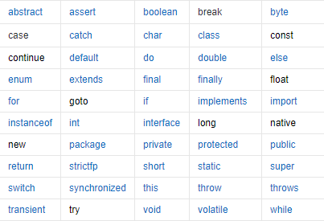
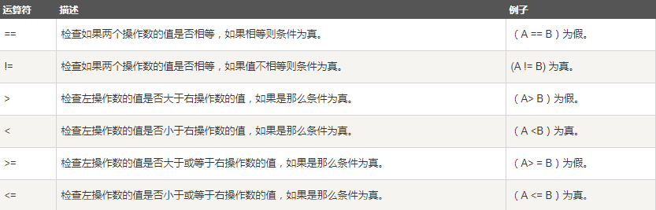
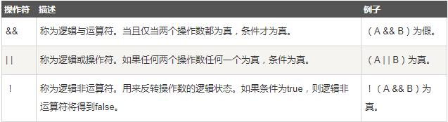
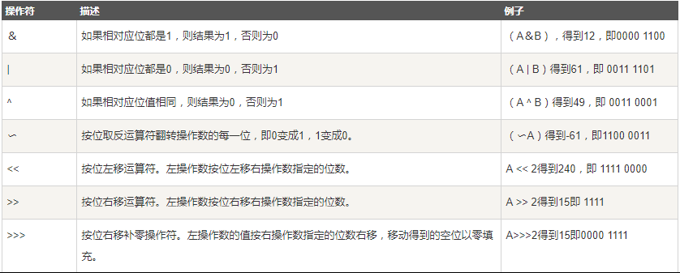

## 注释

+   单行注释：//
+   多行注释：/* 注释 */
+   JavaDoc文档注释注释：/** */
    +   /**开头
    +   */结尾
    +   每行开头一个*
    +   有关键字，自定义的关键字在帮助文档中是不显示的（如@Description，加了@反而不能在帮助文档显示，不如不加@）
    +   参考:[Java 文档注释](https://www.runoob.com/java/java-documentation.html)

```java
public class Hello {
    public static void main(String[] args) {
        //单行注释
        System.out.println("Hello,World!");
        /*
        多行注释
        多行注释
         */

        //JavaDoc：文档注释 /**   */
        /**
         * Hello, world!
         * @author Dong
         */
    }
}
```


## 标识符

**Java中的关键字**

	

Java 所有的组成部分都需要名字,类名、变量名以及方法名都被称为标识符。

**命名的要求规范**:

+   表示类名的标识符用大写字母开始

    `如Man,GoodMan`

+   表示方法和变量的标识符用小写字母开始，后面的描述性词以大写开始。

    `如：eat(),eatFood() //驼峰命名法 `

**关于** Java **标识符，有以下几点需要注意：** 

+   所有的标识符都应该以字母（A-Z 或者 a-z）,美元符（$）、或者下划线（_)开始 
+   首字符之后可以是字母（A-Z 或者 a-z）,美元符（$）、下划线（_）或数字的任何字符组合
+   不能使用关键字作为变量名或方法名。 
+   标识符是大小写敏感的 
+   合法标识符举例：age、$salary、_value、__1_value
+   非法标识符举例：123abc、-salary、#abc

[ JAVA不采用通常语言使用的ASCII字符集，而是采用unicode这样的标准的国际字符集。因此，这里的字母的含义：可以表示英文、汉字等等。] 

[可以使用中文命名，但是一般不建议这样去使用，也不建议使用拼音，很Low]


## 数据类型

Java是一种**强类型语言**，每个变量都必须声明其类型

#### 1、强弱类型语言

+   **强类型语言**也称为强类型定义语言。要求变量的使用要严格符合规定，所有变量都必须先定义后才能使用

+   Java、.NET、C++等都是强制类型定义的。也就是说，一旦一个变量被指定了某个数据类型，如果不经过转换，那么它就永远是这个数据类型了。

+   安全性高，运行效率相对较慢，鱼和熊掌不可兼得！强类型定义语言在速度上可能略逊色于弱类型定义语言，但是强类型定义语言带来的严谨性能够有效的避免许多错误。

---

+   **弱类型语言**也称为弱类型定义语言,与强类型定义相反。像vb，php等就属于弱类型语言
+   在VBScript中，可以将字符串‘12’和整数3进行连接得到字符串‘123’，也可以把它看成整数123，而不需 要显示转换 
+   但其实它们的类型没有改变，VB只是在判断出一个表达式含有不同类型的变量之后，自动在这些变 量前加了一个clong（）或（int）（）这样的转换函数而已。能做到这一点其实是归功于VB的编译器的智能化而已，这并非是VB语言本身的长处或短处。


#### 2、数据类型

Java的数据类型分为两大类：基本类型（primitive type）和引用类型 （reference type）

+   **基本数据类型**：包括 整数、浮点数、字符、布尔。
+   **引用数据类型**：包括 类、数组、接口。

|   数据类型   |    关键字    | 内存占用 |        取值范围        |
| :----------: | :----------: | :------: | :--------------------: |
|    字节型    |     byte     | 1个字节  |        -128~127        |
|    短整型    |    short     | 2个字节  |      -32768~32767      |
|     整型     |  int(默认）  | 4个字节  |  -231次方~2的31次方-1  |
|    长整型    |     long     | 8个字节  | -2的63次方~2的63次方-1 |
| 单精度浮点数 |    float     | 4个字节  | 1.4013E-45~3.4028E+38  |
| 双精度浮点数 | double(默认) | 8个字节  |  4.9E-324~1.7977E+308  |
|    字符型    |     char     | 2个字节  |        0-65535         |
|   布尔类型   |   boolean    | 1个字节  |      true，false       |

>   Java中的默认类型：整数类型是int 、浮点类型是double 。


#### 3、数据类型转换

+   Java程序中要求参与的计算的数据，必须要保证数据类型的一致性，如果数据类型不一致将发生类型的转换。

+   **自动转换**：将取值范围小的类型自动提升为取值范围大的类型 。
    范围小的类型向范围大的类型提升， byte、short、char 运算时直接提升为int 。

    ```java
    public class ZiDongLeiZhuan{ 
        public static void main(String[] args){ 
            char c1='a';//定义一个char类型 
            int i1 = c1;//char自动类型转换为int 
            System.out.println("char自动类型转换为int后的值等于"+i1);         char c2 = 'A';//定义一个char类型 
            int i2 = c2+1;//char 类型和 int 类型计算 
            System.out.println("char类型和int计算后的值等于"+i2); 
        } 
    }
    //解析：c1的值为字符a,查ASCII码表可知对应的int类型值为 97，A对应值为65，所以i2=65+1=66。 
    ```

+   **强制类型转换**：将取值范围大的类型强制转换成取值范围小的类型。(可能损失精度和造成数据丢失)

    ```java
    public static void main(String[] args) {     double x  = 3.14; 
        int nx = (int)x;   //值为3 
    
        char c = 'a'; 
        int d = c+1; 
        System.out.println(d); //98 
        System.out.println((char)d);  //b 
    }  
    ```

    >   	数据类型 变量名 = （数据类型）被转数据值；
    >   	int i = (int)1.5;

#### 4、常见错误和问题

1.   操作比较大的数时，要留意是否溢出，尤其是整数操作时

     ```java
     public static void main(String[] args) { 
         int money = 1000000000;  //10亿 
         int years = 20; 
         int total = money*years;   //返回的是负数 
         long total1 = money*years;  //返回的仍然是负数。默认是int，因此结果会转成 int值，再转成long。但是已经发生了数据丢失 
         long total2 = money*((long)years);   //先将一个因子变成long，整个表达式发 生提升。全部用long来计算。 
         System.out.println(total); 
         System.out.println(total1); 
         System.out.println(total2); 
     }  
     ```

2.   L和l 的问题

     +   不要命名名字为l的变量
     +   long类型使用大写L不要用小写

     ```java
     public static void main(String[] args) {     int l = 2; 
         long a = 23451l; 
         System.out.println(l+1); //3 
         System.out.println(a);   //23451 
     }
     ```

     

## 变量,常量

#### 1、变量（variable）

变量是什么：就是可以变化的量!我们通过变量来操纵存储空间中的数据，变量就是指代这个存储空间！空间位置是确定的，但是里面放置什么值不确定!打个比方： 

这就好像我们家里有一个大衣柜，里面有十分多的小格子，我们给格子上贴上标签，放衣服，放鞋子， 放手表等等，此时我们知道了哪里该放什么，但是，我们并不知道里面到底放的是什么牌子的鞋子，是 衣服还是裤子。那个标签就相当于我们的变量，我们给他起了个名字，但是里面要放什么需要我们自己去放。 

Java是一种强类型语言，每个变量都必须声明其类型。 

Java变量是程序中最基本的存储单元，其要素包括变量名，变量类型和作用域。 变量在使用前必须对其声明, 只有在变量声明以后，才能为其分配相应长度的存储单元，声明格式为：`数据类型 变量名 = 数据值;`

**注意事项:**

+   每个变量都有类型，类型可以是基本类型，也可以是引用类型
+   变量名必须是合法的标识符.变量声明是一条完整的语句，因此每一个声明都必须以分号结束 

```java
int a, b, c;         		// 声明三个int型整数：a、 b、c 
int d = 3, e = 4, f = 5; 	// 声明三个整数并赋予初值 
byte z = 22;         		// 声明并初始化 z 
String s = "runoob";  		// 声明并初始化字符串 s 
double pi = 3.14159; 		// 声明了双精度浮点型变量 pi 
char x = 'x';        		// 声明变量 x 的值是字符 'x'。  
```

**[编码规范] **虽然可以在一行声明多个变量，但是不提倡这个风格，逐一声明每一个变量可以提高程序可读性。


#### 2、变量作用域

变量根据作用域可划分为三种：

+   类变量（静态变量： static variable）：独立于方法之外的变量，用 static 修饰。 

+   实例变量（成员变量：member variable）：独立于方法之外的变量，不过没有 static 修饰。 

+   局部变量（lacal variable)：类的方法中的变量。

```java
public class Variable{ 
    static int allClicks=0;    // 类变量 
    String str="hello world";  // 实例变量 
  
    public void method(){ 
        int i =0;  // 局部变量 
    } 
}
```

**局部变量**

+   方法或语句块内部定义的变量

+   使用前必须先声明和初始化(赋初值),局部变量没有默认值，所以局部变量被声明后，必须经过初始化，才可以使用。 

```java
public static void main(String[] args) { 
    int i; 
    int j = i+5 ; // 编译出错，变量i还未被初始化     
    System.out.println(j); 
}
```

**实例变量**

+   方法外部、类的内部定义的变量,从属于对象，生命周期伴随对象始终

+   如果不自行初始化，他会自动初始化成该类型的默认初始值(数值型变量初始化成0或0.0，字符型变量的初始化值是16位的0，布尔型默认是false)

```java
public class Test { 
    // 这个实例变量对子类可见 
    public String name; 
    // 私有变量，仅在该类可见 
    private double salary;     ... 
}
```

**静态变量**

+   使用static定义,从属于类，生命周期伴随类始终，从类加载到卸载
+   如果不自行初始化，他会自动初始化成该类型的默认初始值 

```java
public class Employee { 
    //salary是静态的私有变量 
    private static double salary; 
    // DEPARTMENT是一个常量 
    public static final String DEPARTMENT = "开发人员"; 
    public static void main(String[] args){ 
        salary = 10000; 
        System.out.println(DEPARTMENT+"平均工资:"+salary);     } 
}
```


#### 3、常量

常量(Constant)：初始化(initialize)后不能再改变值! 所谓常量可以理解成一种特殊的变量，它的值被设定后，在程序运行过程中不允许被改变。

```java
final 常量名=值; 
final double PI=3.14; final String LOVE="hello";  
```

常量名一般使用大写字符。 程序中使用常量可以提高代码的可维护性。例如，在项目开发时，我们需要指定用户的性别，此时可以 定义一个常量 SEX，赋值为 "男"，在需要指定用户性别的地方直接调用此常量即可，避免了由于用户的 不规范赋值导致程序出错的情况。


#### 4、变量的命名规范

1.   所有变量、方法、类名：见名知意 

2.   类成员变量：首字母小写和驼峰原则 : monthSalary 
3.   局部变量：首字母小写和驼峰原则 
4.   常量：大写字母和下划线：MAX_VALUE
5.   类名：首字母大写和驼峰原则: Man, GoodMan 
6.    方法名：首字母小写和驼峰原则: run(), runRun()


## 运算符

Java **语言支持如下运算符：** 

+   算术运算符: +，-，*，/，%，++，--

+   赋值运算符 = 

+   关系运算符: >，<，>=，<=，==，!= ,instanceof 

+   逻辑运算符: &&，||，!
+   位运算符: &，|，^，~ ， >>，<<，>>>
+   条件运算符 ？：
+   扩展赋值运算符:+=，-=，*=，/= 

#### 1、二元运算符

二元运算符有2个操作数。例如，除法运算符"/"有2个操作数。

```java
public static void main(String[] args) { 
    int a = 10; 
    int b = 20; 
    int c = 25; 
    int d = 25; 
    System.out.println("a + b = " + (a + b) );     
    System.out.println("a - b = " + (a - b) );     
    System.out.println("a * b = " + (a * b) );     
    System.out.println("b / a = " + (b / a) ); 
}  
```

**整数运算**

如果两个操作数有一个为Long, 则结果也为long,没有long时，结果为int。

即使操作数全为shot,byte，结果也是int. 

```java
public static void main(String[] args) {     
    long a = 1231321311231231L; 
    int b = 1213; 
    short c = 10; 
    byte d = 8; 

    System.out.println((a+b+c+d));  	//Long类型     
    System.out.println((b + c + d));	//Int类型 
    System.out.println((c + d));		//Int类型 
}
```

**浮点运算** 

如果两个操作数有一个为double, 则结果为double. 

只有两个操作数都是float, 则结果才为float. 

```java
public static void main(String[] args) {     
    float a = 3.14565F; 
    double b = 3.194546464; 
    float c = 1.3123123F; 

    System.out.println(a+b); //double类型     
    System.out.println(b+c); //double类型     
    System.out.println(a+c); //float类型 
}
```

**关系运算符**

返回布尔值

	


#### 2、取模运算

就是我们小学的取余: `5%3 余 2 `

其操作数可以为浮点数,一般使用整数. 

 **要点**：

+   负数%负数＝负数

+   负数%正数＝负数

+   正数%负数＝正数

```java
public static void main(String[] args) {     
    System.out.println(9 % 4); 		//1 
    System.out.println(-9 % -4); 	//-1 
    System.out.println(-10 % 4); 	//-2 
    System.out.println(9 % -4); 	//1 
}  
```


#### 3、一元运算符

**自增（**++**）自减（**--**）运算符**是一种特殊的算术运算符，在算术运算符中需要两个操作数来进行运算， 而自增自减运算符是一个操作数，分为前缀和后缀两种。

```java
public static void main(String[] args) { 
    int a = 3; 
    int b = a++;   //执行完后,b=3。先给b赋值，再自增。     
    int c = ++a;   //执行完后,c=5。先自增,再给b赋值 
}
```

**注意：**java中的**乘幂处理**

```java
public static void main(String[] args) { 
    int a = 3^2;    //java中不能这么处理,^是异或符号。     
    double b = Math.pow(3, 2); //Math类提供了很多科学和工程计算需要的方法和常数。特殊的运算都需要运用到方法!
}
```


#### 4、逻辑运算符

逻辑与：&&(短路与)和&

逻辑或：||(短路或)和|

逻辑非：!

	

```java
public static void main(String[] args) { 
    boolean a = true; 
    boolean b = false; 
    System.out.println("a && b = " + (a&&b)); 
    System.out.println("a || b = " + (a||b) ); 
    System.out.println("!(a && b) = " + !(a && b)); 
}  
```

逻辑与只要有一个为false, 则直接返回false. 

逻辑或只要有一个为true, 则直接返回true; 

**&&和&(||和|)的区别:**

+   前者采用短路方式,从左到右计算,如果确定值则不会再计算下去. 
+   例如:(3<1) && (3>2) 因为(3<1)为false,则不会计算后面表达式(3>2)的值,而直接返回false.而对于&,不管左表达式的值是多少都会区计算右表达式

```java
public class Test {
    public static void main(String[] args) {
        int a=4;
        boolean b=(a>5) && (4/0>1);     //a>5为false,短路,即使4/0是个数学错误,也不会报错,因为根本不会计算右表达式的值,换成&就会报错
        System.out.println(b);
    }
}
```


#### 5、位运算符

Java定义了位运算符，应用于整数类型(int)，长整型(long)，短整型(short)，字符型(char)，和字节型(byte)等类型。

位运算符作用在所有的位上，并且按位运算。

```java
A = 0011 1100 
B = 0000 1101 
----------------- 
A & b = 0000 1100 
A | B = 0011 1101 
A ^ B = 0011 0001 
~A = 1100 0011
```

	

**Tips**:

+   右移一位相当于除2取商
+   左移一位相当于乘2

**例题**:**int a=2*8怎样运算效率最快**

```java
public static void main(String[] args) {     
    System.out.println(2 << 3); 
}
```

**解析**:用移位运算 int a=2<<3;a就是2乘以8最后结果是16,这是最省内存,最有效率的方法

这个方法效率高,解释一下： 

2的二进制是10在32位存储器里面是0000 0000 0000 0010,左移三位后变成 0000 0000 0001 0000 也就是16 

在系统中运算是以二进制的形式进行的。相比来说俩个二进制数相乘运算比移位运算慢一些。 

位操作是程序设计中对位模式按位或二进制数的一元和二元操作。 在许多古老的微处理器上,位运算比加减运算略快,通常位运算比乘除法运算要快很多. 在现代架构中, 情况并非如此:位运算的运算速度通常与加法运算相同(仍然快于乘法运算). 详细的需要了解计算机的组成原理！


#### 6、扩展运算符

| 运算符 | 用法举例 | 等效表达式 |
| ------ | -------- | ---------- |
| +=     | a += b   | a = a + b  |
| -=     | a -= b   | a = a - b  |
| *=     | a *= b   | a = a * b  |
| /=     | a /=b    | a = a / b  |
| %=     | a %= b   | a = a % b  |

```java
public static void main(String[] args) {     
    int a=10; 
    int b=20; 

    a+=b; // a = a + b 

    System.out.println(a+":"+b); 
}
```


#### 7、字符串连接符

“+” 运算符两侧的操作数中**只要有一个是字符串**(String)类型，系统会自动将另一个操作数转换为字符串然后再进行连接

```java
//字符串 
String s1="Hello 中文!"; 
String s2=1+"";  //转换成String 
//int 
int c = 12; 
System.out.println("c=" + c);  
```


 

#### 8、三目条件运算符

三目条件运算符，语法格式：`x ? y : z `

其中x为boolean类型表达式，先计算x的值，若为true，则整个三目运算的结果为表达式y的值，否则整个运算结果为表达式z的值

```java
public static void main(String[] args) { 
    int score = 80; 
    String type = score < 60 ? "不及格" : "及格";     
    System.out.println("type= " + type); 
}  
```


#### 9、运算符优先级

| 优先级 | 运算符                                           | 结合性   |
| ------ | ------------------------------------------------ | -------- |
| 1      | ()、[]、{}                                       | 从左向右 |
| 2      | !、+、-、~、++、--                               | 从右向左 |
| 3      | *、/、%                                          | 从左向右 |
| 4      | +、-                                             | 从左向右 |
| 5      | «、»、>>>                                        | 从左向右 |
| 6      | <、<=、>、>=、instanceof                         | 从左向右 |
| 7      | ==、!=                                           | 从左向右 |
| 8      | &                                                | 从左向右 |
| 9      | ^                                                | 从左向右 |
| 10     | \|                                               | 从左向右 |
| 11     | &&                                               | 从左向右 |
| 12     | \|\|                                             | 从左向右 |
| 13     | ?:                                               | 从右向左 |
| 14     | =、+=、-=、*=、/=、&=、\|=、^=、~=、«=、»=、>>>= | 从右向左 |


## 包机制

#### 1、问题发现

存在这样一个问题：当定义了多个类的时候，可能会发生类名的重复问题

解决方式：在java中采用包机制处理开发者定义的类名冲突问题. 就好比我们平时的用电脑,一个文件夹下不能存在同名的文件,我们要是有这样的需求,但是又不想换名字,我们就可以考虑使用新建一个文件夹来存放! 在Java中也是这样的.


#### 2、包的作用

为了更好地组织类，Java 提供了包机制，用于区别类名的命名空间

1.   把功能相似或相关的类或接口组织在同一个包中，方便类的查找和使用。 
2.   如同文件夹一样，包也采用了树形目录的存储方式。同一个包中的类名字是不同的，不同的包中的类的名字是可以相同的，当同时调用两个不同包中相同类名的类时，应该加上包名加以区别。因此,包可以避免名字冲突。 

3.   包也限定了访问权限，拥有包访问权限的类才能访问某个包中的类。

Java 使用包（package）这种机制是为了防止命名冲突，访问控制，提供搜索和定位类（class）、接 口、枚举（enumerations）和注释（annotation）等。


**包语句的语法格式为**： 

```java
package pkg1[．pkg2[．pkg3…]]; 
```

例如,一个Something.java文件它的内容:

```java
package net.java.util; 
public class Something{    
    ... 
}
```

那么它的路径应该是 net/java/util/Something.java 这样保存的。 package(包) 的作用是把不同的java 程序分类保存，更方便的被其他java程序调用


>   一个包（package）可以定义为一组相互联系的类型（类、接口、枚举和注释） ,为这些类型提供访问保护和命名空间管理的功能
>
>   由于包创建了新的命名空间（namespace）,所以不会跟其他包中的任何名字产生命名冲突。使用包这种机制,更容易实现访问控制,并且让定位相关类更加简单


#### 3、创建包

+   创建包的时候，你需要为这个包取一个合适的名字。之后,如果其他的一个源文件包含了这个包提供的 类、接口、枚举或者注释类型的时候，都必须将这个包的声明放在这个源文件的开头。

+   包声明应该在源文件的第一行，每个源文件只能有一个包声明，这个文件中的每个类型都应用于它。 如果一个源文件中没有使用包声明，那么其中的类，函数，枚举，注释等将被放在一个无名的包(unnamed package)中

+   一般利用公司域名倒置作为报名

    例如:[www.baidu.com](http://www.baidu.com/) 包名:com.baidu.www 


#### 4、import 关键字

为了能够使用某一个包的成员，我们需要在 Java 程序中明确导入该包。使用 "import" 语句可完成此功能

在 java 源文件中 import 语句应位于 package 语句之后，所有类的定义之前，可以没有，也可以有多条，其语法格式为：

```java
import package1[.package2…].(classname|*);
```

如果在一个包中，一个类想要使用本包中的另一个类，那么该包名可以省略。 

要是要用到其他包下的类，就必须要先导包

 如果两个类重名，需要导入对应的包，否则就需要写出完整地址：

```java
com.demo.Hello hello = new com.demo.Hello()
```

 import 关键字引入，使用通配符 "*" , 导入io包下的所有类

```java
import java.io.*;
```

使用 import 关键字引入指定类: 

```java
import com.demo.Hello; 
```