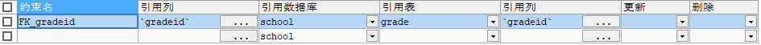
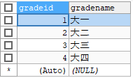
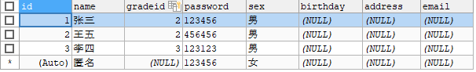
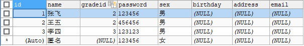
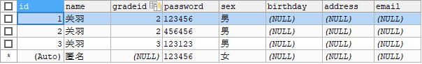
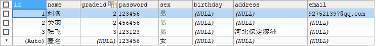

### 外键
> 方式一:在创建表的时候,增加约束(麻烦,比较复杂)
```sql
-- 创建年级表,主键为年级id
CREATE TABLE `grade`(
    `gradeid` INT(10) NOT NULL AUTO_INCREMENT COMMENT '年级id',
    `gradename` VARCHAR(50) NOT NULL COMMENT '年级名称',
    PRIMARY KEY(`gradeid`)
)ENGINE=INNODB DEFAULT CHARSET=utf8;

-- 创建学生表,主键为id,外键为gradeid
-- 学生表的gradeid字段要去引用年级表的gradeid字段
-- 定义外键key
-- 给这个外键添加约束(执行引用)    reference引用
CREATE TABLE `student` (
  `id` INT(4) NOT NULL AUTO_INCREMENT COMMENT '学号',
  `name` VARCHAR(30) NOT NULL DEFAULT '匿名' COMMENT '姓名',
  `gradeid` INT(10) NOT NULL COMMENT '年级id',
  `password` VARCHAR(20) NOT NULL DEFAULT '123456' COMMENT '密码',
  `sex` VARCHAR(2) NOT NULL DEFAULT '女' COMMENT '性别',
  `birthday` DATETIME DEFAULT NULL COMMENT '生日',
  `address` VARCHAR(100) DEFAULT NUL
  L COMMENT '家庭住址',
  `email` VARCHAR(50) DEFAULT NULL COMMENT '邮箱',
  PRIMARY KEY (`id`),
  KEY `FK_gradeid` (`gradeid`), -- 声明约束FK_gradeid(约定俗称取名为FK_外键名)
  CONSTRAINT `FK_gradeid` FOREIGN KEY(`gradeid`) REFERENCES `grade`(`gradeid`) -- 给外键添加约束(引用)
) ENGINE=INNODB DEFAULT CHARSET=utf8;
```


> 方式二:创建表成功后添加外键约束
```sql
-- 创建年级表,主键为年级id
CREATE TABLE IF NOT EXISTS `grade`(
    `gradeid` INT(10) NOT NULL AUTO_INCREMENT COMMENT '年级id',
    `gradename` VARCHAR(50) NOT NULL COMMENT '年级名称',
    PRIMARY KEY(`gradeid`)
)ENGINE=INNODB DEFAULT CHARSET=utf8;

-- 创建学生表,主键为id,不含外键关系
CREATE TABLE IF NOT EXISTS `student` (
  `id` INT(4) NOT NULL AUTO_INCREMENT COMMENT '学号',
  `name` VARCHAR(30) NOT NULL DEFAULT '匿名' COMMENT '姓名',
  `gradeid` INT(10) NOT NULL COMMENT '年级id',
  `password` VARCHAR(20) NOT NULL DEFAULT '123456' COMMENT '密码',
  `sex` VARCHAR(2) NOT NULL DEFAULT '女' COMMENT '性别',
  `birthday` DATETIME DEFAULT NULL COMMENT '生日',
  `address` VARCHAR(100) DEFAULT NULL COMMENT '家庭住址',
  `email` VARCHAR(50) DEFAULT NULL COMMENT '邮箱',
  PRIMARY KEY (`id`)
) ENGINE=INNODB DEFAULT CHARSET=utf8;

-- 通过修改表来添加外键约束
-- ALTER TABLE `表名` ADD CONSTRAINT `约束名` FOREIGN KEY(`作为外键的列`) REFERENCES `被引用表名`(`被引用字段名`);
ALTER TABLE `student` ADD CONSTRAINT `FK_gradeid` FOREIGN KEY(`gradeid`) REFERENCES `grade`(`gradeid`);
```
**`注意`**:删除有外键关系的表时,必须先删除引用别人的表(从表),在删除被引用的表(主表)

**以上操作都是物理外键,数据库级别的外键,不建议使用(避免数据库太多造成困扰)**

**`最佳实践`**
+ 数据库就是单纯的表,只用来存数据,只有行(数据)和列(字段)
+ 想使用多张表的数据,使用外键可用程序实现(一切外键概念在应用层实现)
---
### DML语言
**数据库意义:** 数据存储,数据管理
DML语言(Data Manipulation Language): 数据操作语言
+ insert
+ update
+ delete

#### 添加
> **insert**
**语法:** ```INSERT INTO `表名` ([`字段名1`,`字段名2`,`字段名3`...]) VALUES ('值1','值2','值3'...)```
```sql
-- 插入语句(添加)
-- INSERT INTO `表名` ([`字段名1`,`字段名2`,`字段名3`...]) VALUES ('值1','值2','值3'...)
INSERT INTO `grade` (`gradename`) VALUES ('大一'); -- gradeid设置了AUTO_INCREMENT(自增),所以不需要写
INSERT INTO `student` (`name`,`gradeid`,`password`,`sex`) VALUES ('张三','2','123456','男');

-- 如果不写表的字段,他就会一一匹配(不建议这样)
-- 数据和字段最好一一对应
-- INSERT INTO `grade` VALUES ('大一')这样写会报错,因为'大一'无法匹配gradeid

-- 批量插入
INSERT INTO `grade` (`gradename`) VALUES ('大二'),('大三'),('大四');
INSERT INTO `student` (`name`,`gradeid`,`password`,`sex`) 
VALUES ('王五','2','456456','男'),('李四','3','123123','男');
```
   

**`注意事项`**:
1. 字段和字段之间使用英文逗号隔开
2. 字段是可以省略的,但是后面的值必须要一一对应,不能少(如果有自增字段可用default占位)
3. 可以同时插入多条数据,VALUES后面的值需要使用`,`隔开即可 `VALUES(),(),()...`

#### 修改
> **update**
**语法:** ```UPDATE `表名` SET `列名`='值',[`列名`='值']... WHERE [条件]```
```sql
-- UPDATE `表名` SET `列名`='值',[`列名`='值']... WHERE [条件]

-- 修改学生姓名,指定条件
UPDATE `student` SET `name`='张飞' WHERE `name`='张三';

-- 修改学生姓名,不指定条件,修改所有记录
UPDATE `student` SET `name`='关羽';

-- 修改多个属性
UPDATE `student` SET `name`='刘备',`email`='927521397@qq.com' WHERE `id`='1';
UPDATE `student` SET `name`='张飞',`address`='河北保定涿洲' WHERE `id`='3';
```
  

**条件:**

|操作符|含义|范围|结果|
|---|---|---|---|
| =|等于|`5=6`|false|
| <> 或 !=|不等于|`5<>6` 或 `5!=6`|true|
| \> | 大于 | `5>6` | false |
|< |小于|`5<6`|true|
| >= |大于等于|`5>=6`|false|
|<= |小于等于|`5<=5`|true|
|BETWEEN...AND...|闭区间,在某个范围内|`3 BETWEEN 2 AND 5`|true|
|AND|与|`5>1 AND 1>2`|false|
|OR|或|`5>1 OR 1>2`|true|

**AND和OR**
```sql
-- 多条件定位数据
-- id为3且姓名叫张三的数据被更改
UPDATE `student` SET `name`='张飞',`address`='河北保定涿洲' WHERE `id`='3' AND `name`='张三';
-- id为3或姓名叫张三的数据全部被更改
UPDATE `student` SET `name`='张飞',`address`='河北保定涿洲' WHERE `id`='3' OR `name`='张三';
```
**`注意事项`**:
1. 条件,筛选的条件,如果没有指定则会修改所有的列
2. 多个设置的属性之间,使用英文逗号隔开
#### 删除
> **delete**
**语法:** ```DELETE FROM 表名 [WHERE 条件]```
```sql
-- 删除数据(删库跑路方式一,不推荐)
DELETE FROM `student`;

-- 删除指定数据
DELETE FROM `student` WHERE `id`='1';
```

> **truncate**
**语法:** ```TRUNCATE `表名` ```
```sql
-- 完全清空一个数据库表,表的结构和索引约束不会变(跑路首选方式)
TRUNCATE `student`;
```
> **delete 和 truncate的区别**
+ 相同点:都能删除数据,都不会删除表结构
+ 不同点:
   + truncate 重新设置自增列,计数器归零,新增记录重新开始计数
   + truncate 不会影响事务
   + delete 不会影响自动增量,新增加的记录会按原来的计数器继续增加

了解即可: `DELETE`删除数据后,重启数据库的现象:
+ ~~InnoDB引擎------自增列会从1开始(存在内存当中,断电即失)~~ (新版本已修复)
+ MyISAM引擎------继续从上一个自增量开始(存在文件中,不会丢失)

