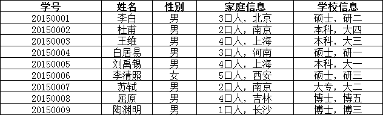
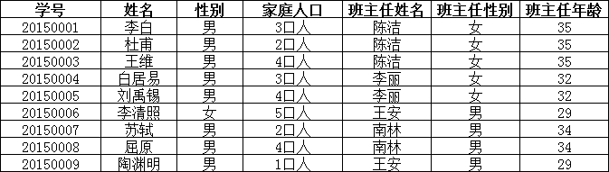

### 设计的意义

**糟糕的数据库设计:**

+   数据冗余,浪费空间
+   数据库插入和删除都会麻烦,容易发生异常
+   程序的性能差

**良好的数据库设计:**

+   节省内存空间
+   保证数据库的完整性
+   方便我们开发系统

**软件开发中,关于数据库的设计**

+   分析需求:分析业务和需要处理的数据库的需求
+   概要设计:设计关系E-R图

**设计数据库的步骤(以个人博客为例):**

+   收集信息,分析需求
    +   用户表(用户登录注销,用户的个人信息,写博客,创建分类)
    +   分类表(文章分类,谁创建的)
    +   文章表(文章的信息)
    +   友链表(友联信息)
    +   自定义表(系统信息,某个关键的字,或者一些主字段)

+   标识实体(把需求落地到每个字段)
+   标识实体之间的关系

---

### 三大范式

**为什么需要数据规范化?**

+   信息重复
+   更新异常
+   插入异常
    +   无法正常显示信息
+   删除异常
    +   丢失有效的信息

>   **三大范式**

**参考链接:**[关系型数据库设计：三大范式的通俗理解](https://www.cnblogs.com/wsg25/p/9615100.html)

**第一范式（1NF）**

+   **要求数据库表的每一列都是不可分割的原子数据项**

举例说明:

 

在上面的表中，“家庭信息”和“学校信息”列均不满足原子性的要求，故不满足第一范式，调整如下：

 

可见，调整后的每一列都是不可再分的，因此满足第一范式（1NF）；

**第二范式（2NF）**

+   **在1NF的基础上，非码属性必须完全依赖于候选码（在1NF基础上消除非主属性对主码的部分函数依赖）**
+   **第二范式需要确保数据库表中的每一列都和主键相关，而不能只与主键的某一部分相关（主要针对联合主键而言）**

举例说明:

 

在上图所示的情况中，同一个订单中可能包含不同的产品，因此主键必须是“订单号”和“产品号”联合组成，但可以发现，产品数量、产品折扣、产品价格与“订单号”和“产品号”都相关，但是订单金额和订单时间仅与“订单号”相关，与“产品号”无关，这样就不满足第二范式的要求，调整如下，需分成两个表：

 

**第三范式（3NF）**

+   **在2NF基础上，任何非主属性不依赖于其它非主属性（在2NF基础上消除传递依赖）**
+   **第三范式需要确保数据表中的每一列数据都和主键直接相关，而不能间接相关**

举例说明:

 

上表中，所有属性都完全依赖于学号，所以满足第二范式，但是“班主任性别”和“班主任年龄”直接依赖的是“班主任姓名”，而不是主键“学号”，所以需做如下调整：

 

**规范性和性能的问题**

+   考虑商业化的需求和目标,数据库的性能更加重要
+   在规范性能的问题的时候,需要适当的考虑一下规范性
+   故意给某些表增加一些冗余的字段(从多表查询变为单表查询)
+   故意增加一些计算列(从大数据量降低为小数据量的查询)

